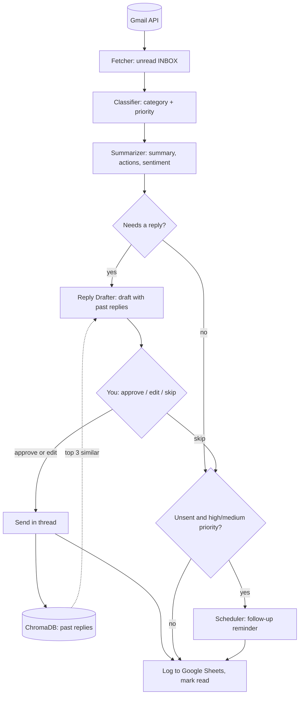

# AI Inbox Automation Agent Suite

A local Python CLI that triages your unread Gmail with five small AI agents, drafts replies from your own past
replies, and sends nothing until you approve it.

## What it does

For each unread email in your inbox, it:

1. **classifies** it (urgent, important, promotional, newsletter, spam, general) and sets a priority (high, medium,
   low),
2. **summarises** it: a 2–3 sentence summary, key points, action items and sentiment,
3. **drafts a reply** for emails that need one, using your most similar past replies as examples (RAG),
4. **asks you** in the terminal to approve and send, give feedback for a rewrite, or skip,
5. **schedules a follow-up reminder** for important emails you didn't answer,
6. **logs** every email to a Google Sheet (optional) and marks it read.

**Why:** most of an inbox needs no reply, and the rest usually needs a short, sensible one. This does the sorting
and the first draft; you keep the final say.

## Features

- Classification and priority from an LLM, with a confidence score and reasoning
- Per-email summary with key points, action items and sentiment
- Reply drafts that reuse your past approved replies (local ChromaDB + sentence-transformers)
- Human approval in the terminal: approve, edit with feedback (the model rewrites), or skip
- Replies sent with the Gmail API in the original thread
- Follow-up reminders stored locally, with a "due follow-ups" check
- Optional Google Sheets activity log
- Run once, or poll continuously every few minutes
- OpenAI or Anthropic as the model provider

## Architecture



No reply is drafted for spam, promotional or newsletter emails, or for anything the classifier marks low priority.
Every agent call asks the model for JSON, so each step returns structured data.

| Module | Role |
|---|---|
| `main.py` | Orchestrator and the interactive menu |
| `agents/fetcher.py` | Fetches unread inbox emails, marks them read |
| `agents/classifier.py` | Category, priority, confidence, reasoning; decides whether to reply |
| `agents/summarizer.py` | Summary, key points, action items, sentiment |
| `agents/reply_drafter.py` | Drafts and refines replies with retrieved examples |
| `agents/scheduler.py` | Follow-up reminders in `data/follow_ups.json` |
| `core/gmail_client.py` | Gmail OAuth, fetch, send, mark read |
| `core/llm_client.py` | OpenAI / Anthropic wrapper (lazy-initialised) |
| `core/vector_store.py` | ChromaDB store of past replies |
| `core/config.py` | Settings loaded from `.env` |
| `utils/sheets_client.py` | Google Sheets logging (gspread) |
| `utils/logger.py` | Logs to the console and `logs/` |

## Quick start

### Requirements

- Python 3.11 (3.13 can fail to build `pydantic-core`; see `docs/ERROR_PYDANTIC_SETTINGS.md`)
- A Google Cloud project with the **Gmail API** enabled (and the **Google Sheets API** if you want the log)
- An OAuth client ID of type **Desktop app**, downloaded as `credentials.json`
- An OpenAI or Anthropic API key (required: every agent calls the model)

### Install

```bash
git clone https://github.com/avnishyadav25/ai-inbox-automation.git
cd ai-inbox-automation
python3.11 -m venv venv
source venv/bin/activate
pip install -r requirements.txt
```

Put `credentials.json` in the project root (it is git-ignored). Step-by-step Google Cloud setup is in
[`SETUP_GUIDE.md`](SETUP_GUIDE.md).

### Configure

```bash
cp .env.example .env
```

Set these in `.env` (names only here; never commit values):

| Variable | Purpose | Default in code |
|---|---|---|
| `AI_PROVIDER` | `openai` or `anthropic` (`.env.example` ships with `anthropic`) | `openai` |
| `OPENAI_API_KEY` | Key for OpenAI (`gpt-4-turbo-preview`) | — |
| `ANTHROPIC_API_KEY` | Key for Anthropic (`claude-sonnet-4-20250514`) | — |
| `GOOGLE_SHEETS_ID` | Sheet for the activity log; leave empty to skip | empty |
| `GMAIL_CREDENTIALS_PATH` | OAuth client file | `credentials.json` |
| `GMAIL_TOKEN_PATH` | Where the OAuth token is saved | `token.json` |
| `EMAIL_CHECK_INTERVAL` | Seconds between checks in continuous mode | `300` |
| `MAX_EMAILS_PER_RUN` | Unread emails per cycle | `50` |
| `REPLY_APPROVAL_REQUIRED` | Ask before sending; `false` sends drafts automatically | `true` |
| `FOLLOW_UP_DAYS` | Days until a follow-up is due | `3` |
| `VECTOR_STORE_PATH` | ChromaDB folder | `./data/vector_store` |
| `EMBEDDING_MODEL` | sentence-transformers model | `all-MiniLM-L6-v2` |

`PRIORITY_HIGH_THRESHOLD` and `PRIORITY_MEDIUM_THRESHOLD` are read into the settings but not used yet.

### Run

```bash
python main.py
```

On the first run a browser window asks you to authorise the Gmail scopes (`gmail.readonly`, `gmail.send`,
`gmail.modify`); the token is saved to `token.json`. The first run also downloads the embedding model.

## Usage

```text
Options:
  [1] Process emails once
  [2] Run continuous automation
  [3] Check follow-ups
  [4] Display statistics
  [5] Exit
```

For each email you see a preview (category, priority, confidence, summary, key points, action items, sentiment).
When a draft is shown:

- `1` approve and send
- `2` edit with feedback: type what to change, the model rewrites the reply and it is sent
- `3` skip

Option `3` lists follow-ups that are due and lets you mark them done. Option `4` shows how many past replies are in
the vector store and your follow-up completion rate.

## Data and privacy

- `credentials.json`, `token.json`, `data/` and `logs/` stay on your machine and are git-ignored.
- Email content is sent to the model provider you choose.
- Sent replies, with the emails they answer, are stored in the local vector store (`data/vector_store`); delete
  that folder to reset it.

## Known limitations

- Only the plain-text part of an email is read; HTML-only emails arrive with an empty body.
- The Sheets logger and the Gmail client share `token.json` but need different OAuth scopes, so on a fresh setup
  one of them can fail with an insufficient-scope error. Leave `GOOGLE_SHEETS_ID` empty if you hit this.
- When you edit a draft with feedback, the original draft (not the edited one) is stored as the example.
- Follow-ups are reminders in the terminal only; nothing is sent or added to a calendar.
- Continuous mode polls Gmail; there is no push notification.
- No automated tests yet.

## Demo

- Demo video: _coming soon_ <!-- TODO: add the YouTube link -->
- Project write-up: _coming soon_ <!-- TODO: https://avnishyadav.com/projects/ai-inbox-agent once published -->

## Roadmap ideas

HTML email parsing, a separate token for Sheets, proper reply headers for threading, Slack or web approval, and
calendar follow-ups.

## License

No license file has been added yet. <!-- TODO (owner): the old README said MIT; add a LICENSE file to make that true, then update this line. -->

## Author

Built by **Avnish Yadav**, AI automation engineer.

- Website: [avnishyadav.com](https://avnishyadav.com)
- YouTube: [@avnishcodes](https://www.youtube.com/@avnishcodes)
- LinkedIn: [avnishyadav25](https://in.linkedin.com/in/avnishyadav25)
- GitHub: [avnishyadav25](https://github.com/avnishyadav25)
